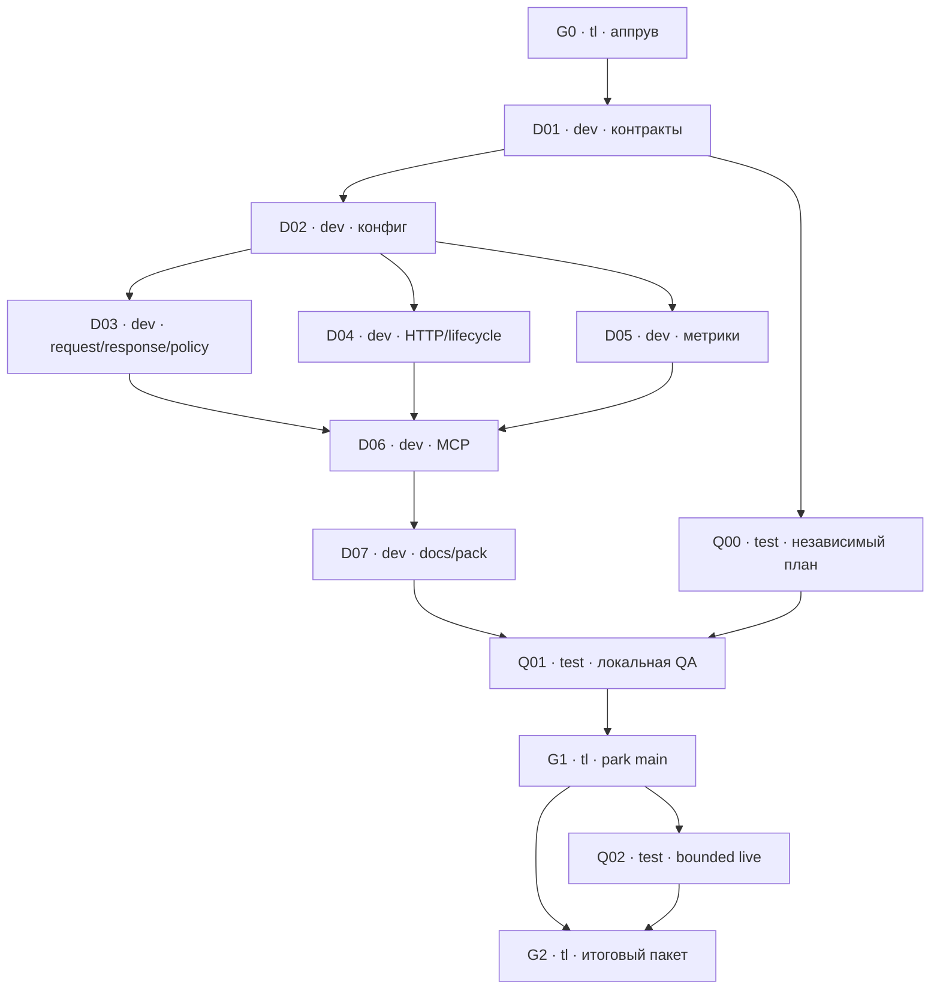

# Decision v0.2 — дерево задач

**Аппрув и текущее состояние — в [PROGRESS.md](PROGRESS.md).** Команда: **tl, dev, test**. Статусы/разрешения ведутся исключительно в [PROGRESS.md](PROGRESS.md); эта карта не является выдачей задач.

Канон: [SPEC v0.2](../SPEC.md), [input schema](../input.schema.json), [output schema](../output.schema.json). База: `delegate-mcp@d622cba5644b844344baac5a6f17a84ab43a9a9e`; [baseline.json](baseline.json) фиксирует байты до реализации. Контекст каждого листа = его файл + явно связанные общие файлы + SPEC, без обращения к переписке.

## Состав: 13 листьев

| ID | Владелец | Результат | Зависит от | Оценка активной работы |
|---|---|---|---|---|
| [G0](00-approval.md) | tl | Явный аппрув и диспетч | — | 0.5–1 ч после аппрува |
| [D01](01-contracts.md) | dev | Типы, runtime schemas и паритет | G0 | 2–3 ч |
| [D02](02-config.md) | dev | Опциональный блок конфигурации | D01 | 2–3 ч |
| [D03](03-decision-core.md) | dev | Request/response и локальная policy | D01, D02 | 3–4 ч |
| [D04](04-http-client.md) | dev | HTTP, очередь, retries, deadline/cancel | D01, D02 | 4–5 ч |
| [D05](05-observability.md) | dev | Отдельные метрики и безопасные ошибки | D01, D02 | 1–2 ч |
| [D06](06-mcp-integration.md) | dev | Четвёртый tool в existing stdio server | D01–D05 | 3–4 ч |
| [D07](07-docs-packaging.md) | dev | English README, examples, npm pack | D06 | 2–3 ч |
| [Q00](08-independent-test-plan.md) | test | Независимые cases/fixtures/oracles | D01 | 1–2 ч |
| [Q01](09-local-acceptance.md) | test | Локальная приёмка, regression, mutations | D07, Q00 | 4–6 ч |
| [G1](10-integration-review.md) | tl | Review и park проверенного кода в main | Q01 | 0.5–1 ч |
| [Q02](11-live-smoke.md) | test | До трёх синтетических POST Jev | G1 и разрешённый live scope | 1–2 ч |
| [G2](12-release-handoff.md) | tl | Итоговый пакет / readiness выпуска | G1, Q02 | 0.5 ч |

## DAG и расписание ролей

D03/D04/D05 независимы по контрактам, но **одна dev-рука исполняет их последовательно**, не три одновременно. Плановый порядок dev: D01→D02→D03→D04→D05→D06→D07. Q00 идёт параллельно с D02–D07; Q01 начинает после сдачи D07. Срок ожидания разрешения/свободной руки не входит в оценку. Первая контрольная точка исполнительного листа — не позднее 90 минут после выдачи.

Ориентир: dev 17–24 ч, test 6–10 ч, tl 1.5–2.5 ч; всего 24.5–36.5 человеко-часов. Последовательный критический путь с перекрытием Q00 — около 3–5 рабочих дней без ожидания/доработок. Это плановая оценка, календарное обязательство устанавливается при аппруве и подтверждении аллокации.

## Границы аппрува и результат этапа

Аппрув на **это дерево целиком** охватывает: реализация, локальная независимая QA, park в main после PASS и ограниченный live-план Q02 (до трёх платных POST без retries). Владелец может явно одобрить только локальную часть; тогда Q02 остаётся HOLD, готовность реальной интеграции — NOT_RUN. До аппрува ни dev, ни test не получают leaf dispatch и не начинают worktrees/build/tests/Keychain/API работу.

npm publish, tag/GitHub Release, запуск release workflow и активация MCP у команды **вне разрешения этого этапа**. G2 готовит проверенный release-кандидат; публикация требует отдельного поручения владельца существующего выпуска. Нельзя назвать готовность выпуска PASS, если обязательный live smoke не пройден и владелец не решил принять NOT_RUN.

## Общие документы и покрытие

- [_shared/context.md](_shared/context.md) — scope, clean-slate, последовательность выдачи, worktrees, evidence и запреты.
- [_shared/interfaces.md](_shared/interfaces.md) — S1–S7 между листьями, предлагаемые вместе с аппрувом.
- [_shared/acceptance.md](_shared/acceptance.md) — SPEC→leaf→oracle, local/full-suite/npm-install и M1–M6.
- [tree.json](tree.json) — машиночитаемый DAG; статусы берутся из PROGRESS, не дублируются в JSON.

Мутирующие проверки выполняет test. tl готовит критерии, читает evidence и интегрирует точный проверенный SHA; runtime QA руками tl не проводится. Разногласие с каноном — finding и остановка затронутого пункта, а не самостоятельное изменение спеки.
